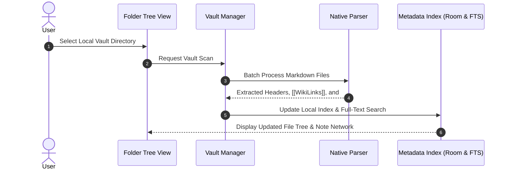
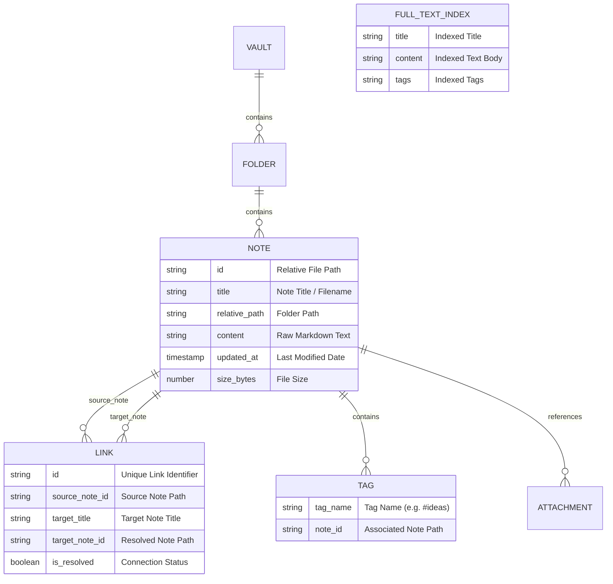
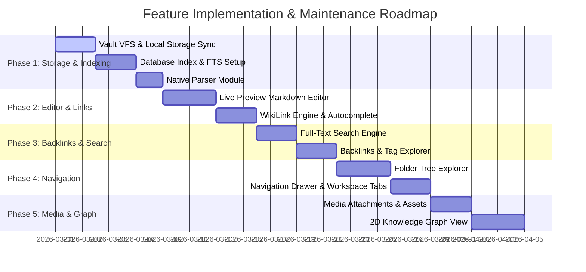

# Markdown Knowledge Base Editor Specification & Architecture

## Executive Summary
This document serves as the primary technical specification and product blueprint for transforming the application into a local-first **Markdown Knowledge Base & File Editor** (Obsidian/Inkdrop style). It is designed to help product managers, engineers, and maintainers understand the feature set, system design, data structures, and multi-phase roadmap.

---

## 1. Product Owner (PO) Vision & Strategic Horizon

### 1.1 Strategic Vision & Mission
To build the most responsive, private, and intuitive mobile-first Personal Knowledge Management (PKM) tool. The application empowers users to build a connected "second brain" using standard, human-readable Markdown files stored directly on their own devices.

### 1.2 Core Product Pillars
- **Local-First & Zero Lock-In**: Notes are plain-text Markdown (`.md`) files stored in user-selected local directories (Vaults). Users retain 100% ownership and portability.
- **Networked Thought**: Bidirectional links (`[[WikiLinks]]`) connect thoughts organically, transforming scattered ideas into a structured web of knowledge.
- **Frictionless Mobile Writing**: Combining raw Markdown power with WYSIWYG Live Preview formatting, customizable toolbars, and instant media attachments.
- **Privacy & Longevity**: Data remains accessible even without internet connectivity and across decades of software evolutions.

### 1.3 Future Feature Horizon
- **Canvas & Whiteboard View**: Infinite spatial canvas for arranging notes, cards, mind maps, and visual links.
- **Plugin & Extension System**: Extensible architecture supporting custom themes, Kanban boards, LaTeX math rendering, and habit trackers.
- **Encrypted Vaults**: Optional AES-256 local vault encryption for confidential journals and private work.
- **Flexible Sync Options**: Built-in support for peer-to-peer sync (Syncthing), Git repositories, WebDAV, and custom cloud storage adapters.

---

## 2. Chief Technology Officer (CTO) Technical Vision & Principles

### 2.1 Architectural Philosophy
- **Filesystem as the Single Source of Truth**: The local directory structure is authoritative. The internal database (Room & SQLite FTS5) functions purely as a high-speed, rebuildable query index.
- **Sub-16ms UI Performance**: Editor typing, file navigation, and canvas rendering must run at 60–120 FPS without UI thread stutter.
- **Native C++ Parser Acceleration**: Computationally heavy text scanning, YAML frontmatter extraction, and WikiLink regex processing are offloaded to C++ via JNI.

### 2.2 Technical Strategy for Scale & Resilience
- **Crash-Resistant File Operations**: Atomic write-and-swap file operations prevent file corruption during unexpected app terminations or power loss.
- **Incremental Background Indexing**: File System Watchers trigger incremental index updates only for modified files, keeping battery and CPU consumption low.
- **SQLite FTS5 Tokenization**: Advanced full-text index tokenization optimized for technical notes, symbol matching, and tags.

### 2.3 Long-Term Technical Roadmap
- **On-Device Local AI Integration**: Native integration with lightweight on-device models (e.g. Gemini Nano / executorch) for offline note summarization, automated backlink suggestions, and semantic search without transmitting data to external servers.
- **Multi-Device Sync Adapter Engine**: Modular sync architecture capable of performing 3-way text diffing and conflict resolution across devices.

---

## 3. High-Level System Architecture

```mermaid
graph TD
    subgraph UI Layer [User Interface]
        A1[Folder Tree Explorer]
        A2[Live Preview Editor]
        A3[Backlinks & Mentions Panel]
        A4[Interactive Knowledge Graph]
        A5[WikiLink Autocomplete Overlay]
    end

    subgraph Logic Layer [ViewModels & Use Cases]
        B1[Vault & Workspace Management]
        B2[Editor & Formatting State]
        B3[Backlink & Tag Resolution]
        B4[Full-Text Search Engine]
    end

    subgraph Storage & Indexing Layer [Data & Native Processing]
        C1[Vault Manager - Local File System]
        C2[Metadata Database & Search Index]
        C3[Native C++ Parsing Engine]
    end

    UI Layer --> Logic Layer
    Logic Layer --> Storage & Indexing Layer
```

---

## 4. Vault Storage & Local File System

### 4.1 Local-First Vault Principles
- **User Ownership**: Notes remain standard Markdown files stored on the device's local file system or external SD card.
- **Storage Access Framework (SAF)**: The app requests persistent read/write folder access, allowing seamless synchronization with external services like Syncthing, Git, or cloud drives.
- **Dedicated Asset Storage**: Images, camera captures, and voice recordings are saved to a dedicated asset folder (such as `_assets/`) within the vault.

### 4.2 Synchronization & Vault Indexing Protocol



---

## 5. Data Structure & Indexing Strategy

Rather than relying solely on database records, the primary source of truth is always the Markdown files in the local vault. The internal SQLite database functions purely as a fast query cache and full-text search index.

### 5.1 Entity Relationship Diagram



### 5.2 Data Specifications

#### Note Record (`notes`)
- **Relative Path (`id`)**: Uniquely identifies each note within the vault (e.g., `Projects/Roadmap.md`).
- **Title**: Derived from filename or top-level Markdown header (`# Title`).
- **Content**: Raw Markdown text content read from the file.
- **File Metadata**: Last modification timestamp and file size for incremental re-indexing.

#### Bidirectional Link Record (`links`)
- **Source Note ID**: Path of the note containing the link.
- **Target Title**: The title specified inside `[[Target Title]]`.
- **Target Note ID**: Resolved path of the destination note (or empty if the target note does not exist yet).
- **Resolved Status**: Boolean flag indicating whether the link points to an existing note.

#### Tag Record (`tags`)
- Stores individual `#tags` extracted from note contents to support tag filtering and tag cloud exploration.

#### Full-Text Search Index (`notes_fts`)
- High-speed virtual table enabling instant phrase and keyword matching across titles, body content, and tags.

---

## 6. WikiLinks & Backlink Engine

### 6.1 Link Syntax Support
- **Standard WikiLink**: `[[Project Roadmap]]` -> Connects to `Project Roadmap.md`.
- **Aliased WikiLink**: `[[Project Roadmap|2026 Strategy]]` -> Displays "2026 Strategy" as link text while linking to `Project Roadmap.md`.
- **Section Anchor**: `[[Project Roadmap#Timeline]]` -> Links to the specific header section.

### 6.2 Auto-Completion & Editing Workflow

```mermaid
flowchart TD
    A[User Enters Text in Editor] --> B{Typed '[[' Trigger?}
    B -- Yes --> C[Open Link Autocomplete Pop-up]
    C --> D[Search Index by Note Title]
    D --> E[Display Suggestions List]
    E --> F[User Selects Target Note]
    F --> G[Insert '[[Title]]' into Note Text]

    B -- No --> H[Process File Change]
    H --> I[Parse Note Content for WikiLinks]
    I --> J[Update Bidirectional Link Index]
    J --> K[Refresh Incoming Backlinks]
    K --> L[Update Backlinks View]
```

### 6.3 Backlink Panel
- Displays all notes that link to the current active note.
- Highlights unlinked mentions (notes containing the active note's title without `[[...]]` markup), allowing users to convert them into active links with a single tap.

---

## 7. Interactive Knowledge Graph

### 7.1 Visualization Concept
- **Nodes**: Represent individual Markdown notes in the vault. Circle diameter increases dynamically with the number of incoming links.
- **Edges**: Represent active links between notes.
- **Physics Engine**: A force-directed layout applies repulsive forces between nodes and spring tension along connected links, allowing note clusters to form naturally.

### 7.2 User Interactions
- **Tap Node**: Opens the corresponding note in the editor.
- **Pinch & Pan**: Zoom and navigate across large knowledge graphs.
- **Filter Controls**: Filter graph nodes by tag, folder hierarchy, or search keyword.

---

## 8. High-Performance Native Parsing Engine

To keep the user interface responsive when opening large vaults containing thousands of files, heavy text processing operations are handled by a high-performance native parsing module:
- **YAML Frontmatter Extraction**: Rapidly extracts metadata headers (e.g. `title`, `tags`, `aliases`, `date`) from the beginning of Markdown files.
- **WikiLink Regex Parsing**: Fast string scanner that locates all `[[...]]` pattern occurrences across large text bodies.
- **Tag Extraction**: Scans for `#tags` while ignoring code blocks, inline code snippets, and URL strings.

---

## 9. Phased Implementation Roadmap



| Phase | Milestone | Focus Areas | Key Deliverables |
| :--- | :--- | :--- | :--- |
| **Phase 1** | **Vault Storage & Indexing** | Storage & Data Layer | SAF Vault File Manager, SQLite FTS Index, Native Parser Integration. |
| **Phase 2** | **Markdown Editor & WikiLinks** | Editing & Linking Engine | Live Preview Editor, WikiLink syntax parsing, Link Autocomplete pop-up. |
| **Phase 3** | **Backlinks & Search Engine** | Discovery & Query | Incoming Backlinks panel, Unlinked mentions, Full-text instant search, Tag Explorer. |
| **Phase 4** | **Folder Tree & Navigation** | User Interface | Collapsible Folder Tree view, Workspace side drawer, Tablet multi-pane layout. |
| **Phase 5** | **Media & Knowledge Graph** | Multimedia & Visualization | Attachment management (`_assets/`), 2D Force-Directed Knowledge Graph canvas. |
